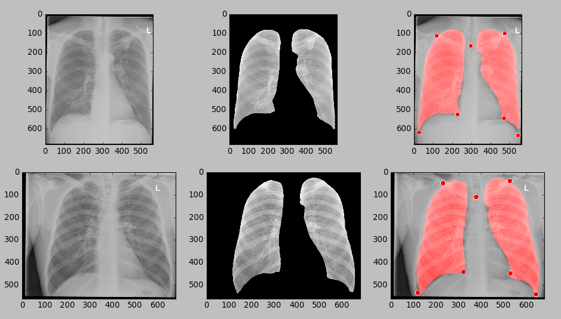

X-Ray ling segmentation based on non-rigid registration technics
================================================================

Web-demo: [X-Ray segmentation](http://imlab.grid.by/appsegmxr/)

To launch demo, just run command in this directory:
```
 python run_sample.py
 ```
 
 If all is ok, you should see the picture like this:
 
 
 
 
For this demo you need to install [Elastix](http://elastix.isi.uu.nl/).

We use Elastix for non-rigid registration stage of the algorithm

Also you need the following Python packages: **numpy**, **opencv**, **scikit-learn**, **scikit-image**


