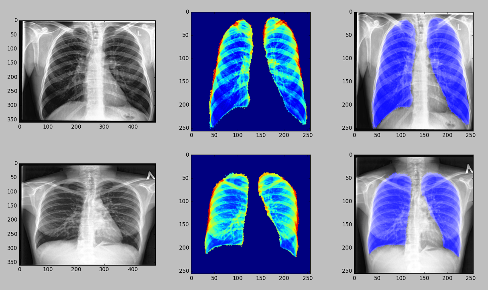

SegNet base X-Ray lung segmentation
===================================

For more information, see article:
[Lung Image Segmentation Using Deep Learning Methods and Convolutional Neural Networks](https://www.researchgate.net/publication/301927359_Lung_Image_Segmentation_Using_Deep_Learning_Methods_and_Convolutional_Neural_Networks)

Demo based on SegNet algorithm: [Alex Kendall, Vijay Badrinarayanan, Roberto Cipolla: SegNet](http://mi.eng.cam.ac.uk/projects/segnet/)

To launch demo, just run command in this directory:
 ```
 python run_sample.py
 ```
 
 If all is ok, you should see the picture like this:
 
 
 
 
To work correctly run of this demo you need to install SegNet version of
Caffe framework from this repo: [alexgkendall/caffe-segnet](https://github.com/alexgkendall/caffe-segnet)

Also you need the following Python packages: **numpy**, **scikit-image**, **pydicom**

